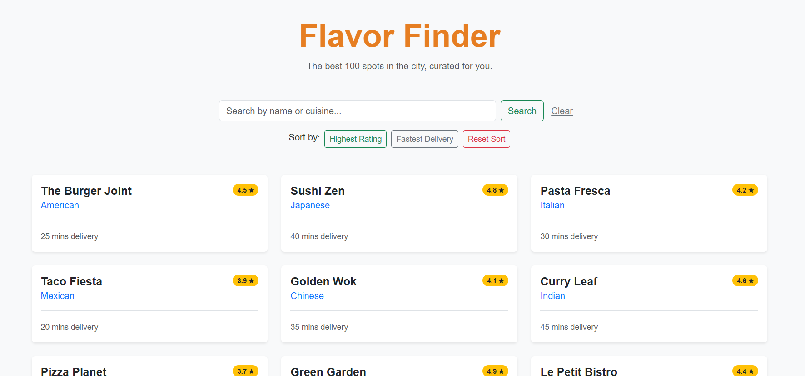

# Restaurant Discovery App

This is a responsive web application built with **Python** and **Flask**. It allows users to browse a registry of 100 restaurants, search by name or cuisine, and sort results by rating or delivery speed.

## 🚀 How to Run the App

Follow these steps to get the application running on your local machine:

### 1. Set up the Environment
Open your terminal in the project folder and create a virtual environment:

python -m venv venv

### 2. Activate the Environment
Windows:
.\venv\Scripts\activate

### 3. Install Dependencies
Ensure you have the necessary libraries installed:

pip install -r requirements.txt

### 4. Start the Server
Run the Flask application:

python app.py

### 5. Access the App
Open your web browser and navigate to:
http://127.0.0.1:5000

## 🛠️ Tech Stack & Design Decisions
# Backend: Python & Flask (Primary Focus)
As a Backend-focused engineer, my priority was creating a robust data pipeline and efficient logic:
Why Flask? I chose Flask for its "micro" philosophy. For a registry of 100 items, a heavy framework like Django would be overkill. Flask allows for a clean, performant, and readable codebase.
Data Processing: I implemented a custom filtering and sorting engine using Python's list comprehensions and lambda functions. This ensures $O(n)$ search efficiency, providing immediate results without the overhead of a database for this specific dataset size.Error Handling: The data_loader.py module includes try-except blocks to handle missing files or corrupted JSON, ensuring the backend never crashes unexpectedly.
# Frontend: Jinja2 & Bootstrap 5Server-Side Rendering (SSR): 
By using Jinja2, the data is processed on the server before being sent to the client. This keeps the business logic on the backend where it belongs.Responsive UI: I used Bootstrap 5 to ensure the "Discovery" experience is functional across all device sizes with zero custom CSS maintenance.

## ⚙️ Key Features
Dynamic Search: Filter the list of 100 restaurants by typing a Name or Cuisine. The search is case-insensitive.

Smart Sorting:

Highest Rating: Sorts restaurants from 5.0 stars down to 1.0.

Fastest Delivery: Sorts restaurants by the shortest delivery time first.

Data Integrity: Uses a modular data_loader.py script to safely parse the restaurants.json dataset.

Responsive UI: Built with a Bootstrap 5 grid system, making the app functional on both mobile and desktop devices.

## 📂 Project Structure
app.py: The main entry point. Handles routing, filtering, and sorting logic.

data_loader.py: Backend script for loading the JSON data.

templates/index.html: The frontend layout using Jinja2 templating.

restaurants.json: The source dataset containing 100 restaurant entries.

requirements.txt: List of Python dependencies.

